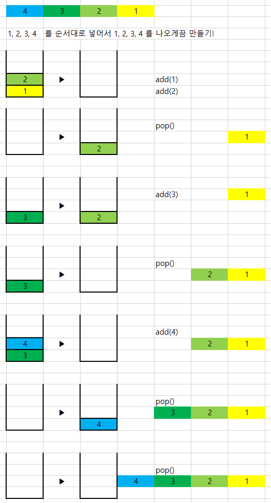

### Stack 2개로 큐 구현하기

- 스택으로 1, 2, 3, 4를 넣었을 때 그대로 나올 수 있는 자료구조 큐를 만들어보자

- 

- 포인트는 두 개의 큐에서 두 번째 큐가 비게 되면 첫 번째 큐를 모두 pop해서 두 번째 큐에 push하는 것이다
- 그럼 큰 숫자가 더 위에 오도록 바뀔 것인데 가장 위의 수를 pop해서 리턴해주면 된다

```

<code>package COMMON;

import java.util.Stack;

public class MyQueue {

    public static void main(String[] args) {
        StackQueue q = new StackQueue();


        q.inQueue(1);
        q.inQueue(2);

        System.out.println(q.outQueue());

        q.inQueue(3);

        System.out.println(q.outQueue());
        System.out.println(q.outQueue());

    }


    static class StackQueue{
        Stack inqueue;
        Stack outqueue;

        StackQueue(){
            this.inqueue = new Stack<>();
            this.outqueue = new Stack<>();

        }

        void inQueue(int v){
            inqueue.add(v);

        }

        int outQueue(){
            if(outqueue.isEmpty())//** point **
            while(!inqueue.isEmpty()){
                outqueue.add(inqueue.pop());
            }
            return outqueue.pop();
        }


    }
}

</code>

```

---

- 출처
  - [https://limkydev.tistory.com/185](https://limkydev.tistory.com/185)
