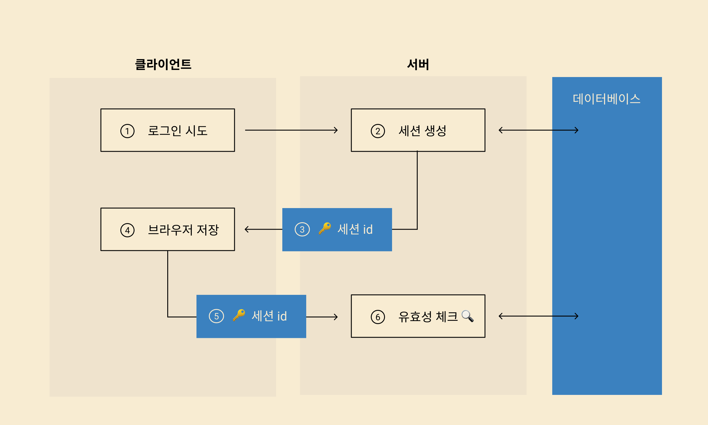
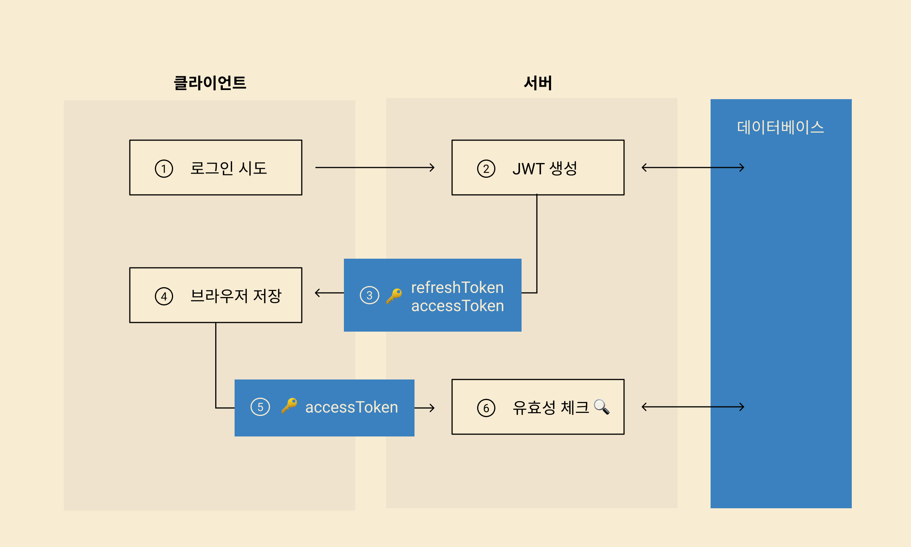

### 로그인 과정

1. 세션id 로그인 방식
   1. 유저 로그인 시도
   2. 서버는 세션 생성
   3. 생성한 세션의 id를 클라이언트에 전송
   4. 클라이언트는 id를 클라이언트에 저장
   5. 인증이 필요한 데이터를 가져올 때 서버에 id값을 보내면 서버는 그 id값을 통해 세션을 불러와 유효한지 확인하는 방식

- 

2. JWT 이용하는 방식

   1. 유저가 로그인 시도
   2. 서버가 JWT 안에 인증정보 담아 보내줌 (암호화, 시그니처 추가 가능)

   - 실질적인 인증정보는 `accessToken`이다. 이것은 일정 시간이 지나면 만료하는 구조를 가진다.
   - refreshToken을 이용해 로그인을 지속적으로 유지할 수 있다.

   3. 담기는 정보 중 accessToken과 refreshToken이 이후 유저 인증에 사용된다.
   4. 이 정보를 클라이언트에 저장한다.
   5. accessToken으로 인증이 필요한 정보에 접근할 때 서버에 전달한다.
   6. 서버는 그 토큰이 유효한지 확인하는 방식으로 인증한다.

- 

### 보안 뚫리는 과정

### 브라우저 저장소 종류 및 보안 이슈

### 요약

- JWT 사용
- `refreshToken`은 `secure httponly쿠키`로 `accessToken`은 `JSON payload`로 전달받는다.
- 서버로 전송할 때마다 refreshToken을 이용해 새로운 accessToken을 받아와 웹 앱내 지역변수에 저장하고 사용한다
- 이런 방식으로 CSRF 공격과 `다른 선택지보다는` XSS공격에서 안전할 수 있다.
- 꼭 XSS 관련 처리를 해줘야한다.
