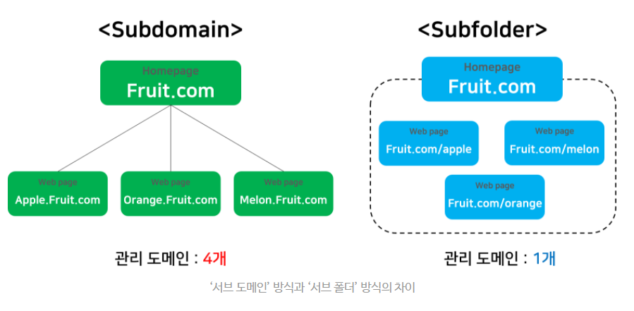

## 검색엔진최적화 SEO

> 홈페이지 혹은 콘텐츠를 검색 결과 상단에 위치시키는 작업. 노출시키는 작업은 광고와 SEO 두 가지가 있다

- 광고와 달리 SEO는 비용이 들지 않고 지속적으로 노출이 가능하다

### 검색엔진

- 인터넷에 산재한 다양한 정보를 미리 수집, 정리한 후 검색 유저가 관련 내용을 검색했을 때 수시로 찾을 수 있도록 도와주는 데이터베이스 관리 시스템

  (ex. 네이버, 구글 검색 엔진)

- `크롤링`(웹 크롤러로 웹사이트 관련 데이터 가져오는 과정)과 `인덱싱`(크롤링 통해 얻은 정보를 검색 색인에 저장하는 과정)으로 정보를 카테고리화한다

### 테크니컬 SEO

- 도메인 관리, 사이트맵, robot.txt

1. 도메인 관리

   - 하나의 도메인을 여러 웹사이트 주소로 나눠 관리하는 방법

    

   제가 평소에 하던 방식은 subfolder방식이군요

   - 도메인 점수를 높게 받으면 검색 결과 상단에 노출된다

2. 사이트맵 제출

   - 웹사이트의 모든 페이지들을 목차처럼 보여주는 `xml형식`의 파일
   - 일반적인 `크롤링 과정에서 발견하지 못한 페이지들도 문제 없이 크롤링, 인덱싱될 수 있다`

3. robot.txt

   - 검색 엔진 웹 크롤러(검색 로봇)에게 `사이트맵 위치를 안내`하고 `특정 웹 크롤러가 정보를 수집하는 걸 차단`한다
   - 크롤러가 `중복된 콘텐츠의 웹페이지를 제한 없이 수집해 검색엔진 평가에 부정적인 영향을 미치는 것을 막는다`
   - 구글은 중복 콘텐츠에 대한 페널티가 있다
   - 사이트 루트 디렉토리에 위치시켜 설정할 수 있다

   ### 콘텐츠 SEO

   - 콘텐츠 내 요소를 가지고 노출 가능성을 높이는 작업
   - 키워드 관리 (데이터에 기반한 키워드)

---

- 출처
  - [https://www.bloter.net/archives/309882](https://www.bloter.net/archives/309882)
