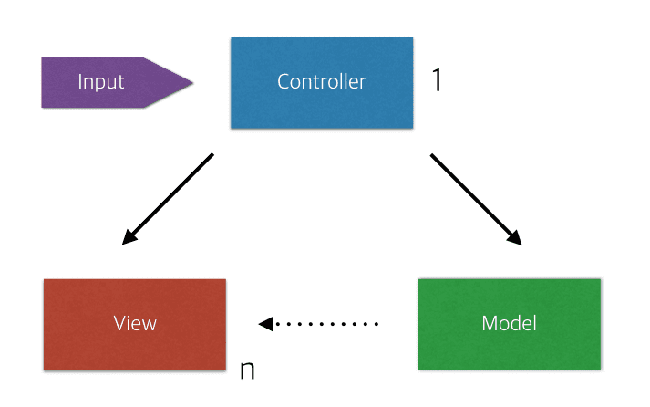
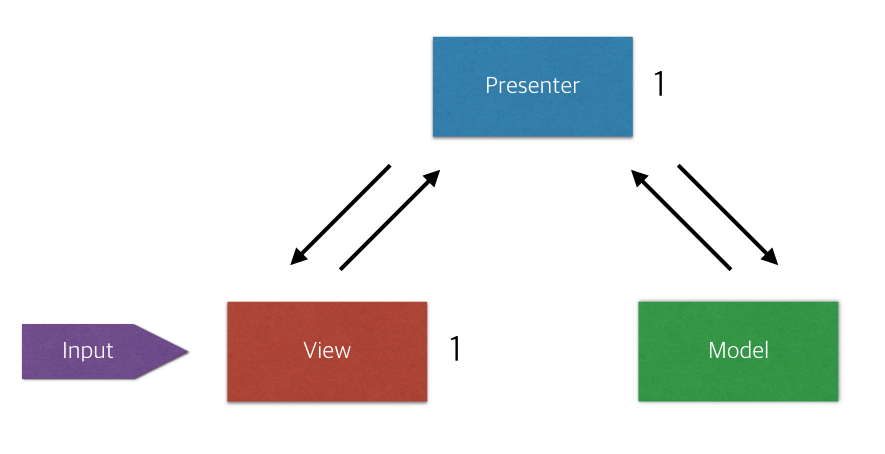
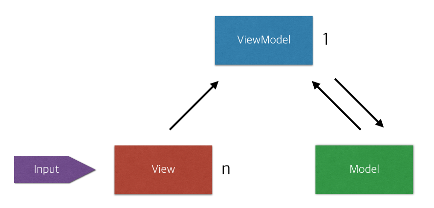

### 프레임워크 패턴

> 공통점: 화면에 보여주는 로직과 실제 데이터가 처리되는 로직을 분리한다

### MVC

  

> Model

- 실제 데이터 및 데이터 조작 로직을 처리하는 부분

> View

- 사용자에게 보여지는 UI 부분
- 웹페이지나 모바일 어플의 화면

> Controller

- 사용자 입력을 받고 처리하는 부분

> FLOW 흐름

1. 컨트롤러로 사용자 입력이 들어온다
2. 컨트롤러는 모델에 데이터 업데이트 및 GET 요청한다
3. 모델은 데이터를 보여줄 뷰를 선택해 화면에 보여준다

> 단점

- VIEW와 MODEL이 서로 의존적이다
- 의존성을 줄이기 위해 MVP패턴이 나왔다

### MVP

- MVC의 controller 대신 presenter가 존재한다

  

> PRESENTER

- VIEW에서 요청한 정보를 모델로부터 가공해서 뷰로 전달한다

> MVC와 차이점

- 사용자의 입력이 VIEW로 들어온다.
- 모델과 뷰는 프레젠터와 각각 상호작용을 한다. (서로의 존재를 모름)
- 뷰, 모델의 의존성이 없어진다
- 중간지점의 느낌

> MVP 단점

- 모델과 뷰의 의존성이 없으나 뷰와 프레젠터가 1:1로 강한 의존성을 갖는다
- MVVM이 등장

### MVVM

> View Model이라는 것이 등장. 뷰를 표현하기 위한 뷰를 위한 모델

  

- 두 가지 디자인 패턴을 이용한다 (command패턴, data binding 패턴)
- view와 viewModel 의존성이 사라진다
- view 모델에 명령을 내리면 data binding으로 view model 값이 변하면
  자동으로 view의 정보가 바뀐다

1. command패턴으로 view에 입력이 들어오면 view model에 명령을 한다
2. 뷰모델은 필요한 데이터를 모델에 요청한다.
3. 모델은 뷰 모델이 필요한 데이터를 응답한다.
4. 뷰 모델은 받은 데이터를 가공해서 저장한다
5. 뷰는 뷰 모델과의 data binding패턴으로 자동으로 갱신된다.

---

- 출처
  - [https://magi82.github.io/android-mvc-mvp-mvvm/](https://magi82.github.io/android-mvc-mvp-mvvm/)
