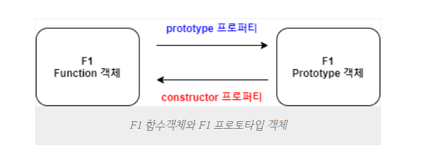
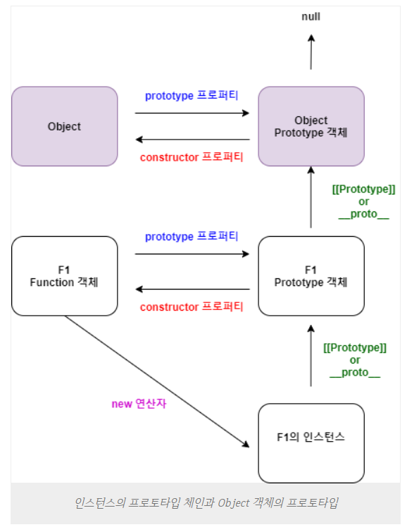

### 프로토타입 객체

- 자바스크립트에서 거의 모든 객체는 Object 객체의 인스턴스
- Object.prototype의 프로퍼티와 메소드를 상속받는다([[Prototoype]]로 접근가능)
- 대부분의 객체는 prototype을 원형으로 만들어져 js는 프로토타입 기반 언어이다.

    

- F1 함수 객체 내부에 prototype이라는 프로퍼티가 F1의 프로토타입 객체를 참조한다
- F1의 프로토타입 객체의 constructor 프로퍼티는 f1함수 객체를 찹조한다

```
function f() {}
f.prototype.testName = 'test';
console.log(f.prototype.testName); //test
console.log(f.testName);//undefined
```

- prototype과 constructor로 서로 참조가 가능하다면서 undefined가 나왔다.
- prototype 객체에 프로퍼티를 추가했을 뿐 f함수에 새로운 프로퍼티는 추가되지 않았다.

- f 프로토타입 객체의 프로퍼티를 사용하기 위해서는 new 키워드로 객체 생성해야된다.

```
let a=new f();
console.log(a.testName); //test
```

- new 생성자로 생성한 a는 f함수 객체를 참조하고 이 함수는 프로퍼티로 `__proto__`가 있다

- a는 `__proto__`프로퍼티로 프로토타입 객체에 접근할 수 있지만 수정할 수는 없다. (인스턴스의 프로퍼티를 수정한다고 프로토타입 프로퍼티도 변경되지는 않는다.)
- 프로토타입 객체의 프로퍼티 값을 수정하거나 삭제하고 싶다면 prototype프로퍼티로 접근해야한다.

```

f.prototype.testName='test2';

```

- 생성자 함수 안에서 메소드를 정의하면 new로 객체를 생성할 때마다 동일한 객체가 생성된다

```
function Test(){
    ...
    this.sum=function(){ // 이 sum은 new Test()가 실행될 때마다 새로 생성된다
        return this.a+this.b;
    }
}

```

- 프로토타입 키워드로 생성하면 프로토타입에 프로퍼티 메서드로 생성된다

```
function Test(){

}

Test.prototype.sum=function(){}


```

- 내부 프로퍼티 [[Prototype]] === `__proto__`

- es6부터 `__prototype__` 이라는 이름을 가진 프로퍼티에 [[Prototype]]의 값이 저장되오 참조할 수 있게 되었다.
- prototype 프로퍼티 = 그 함수 이름으로 된 프로토타입 객체를 참조값으로 가진다
- `__proto__`프로퍼티는 그 객체에서 상속을 해준 부모 객체를 참조값으로 가진다
- `__proto__`프로퍼티를 타고 부모 객체로 올라가며 필요한 프로퍼티와 메서드를 검색하는 것을 `프로토타입 체인`이라고 한다.

### new 연산자로 객체 생성시 프로세스

1. 빈 객체의 생성
   `let obj={};`
2. 프로토타입의 설정
   ` obj.__proto__=생성자함수.prototype;`
3. 객체의 초기화
   `생성자함수.apply(obj,arguments);`
4. 생성된 객체를 반환
   `return obj;`

    

- 인스턴스가 생성된 후 프로토타입을 수정하거나 교체해도 반영되지 않는다
  - 인스턴스의 프로퍼티는 `생성되는 시점의 프로토타입`에서 상속받는다

### prototype 관련 함수

1. Object.getPrototypeOf(변수명)

   - 객체의 프로토타입 객체를 가져온다

2. 객체 instance of 생성자

   - 지정한 객체의 프로토타입 체인에 지정한 생성자의 프로토타입 객체가 포함되었는지 확인

3. 프로토타입객체.isPrototypeOf(객체)

- 특정 객체가 다른 객체의 프로토타입 체인에 포함되어 있는 객체인지 판정
  `F.prototype.isPrototypeOf(obj)`

---

- let newObj=Object.create(null)
  - 인수에 null을 넣으면 프로토타입이 없는 객체를 만들 수 있다.


