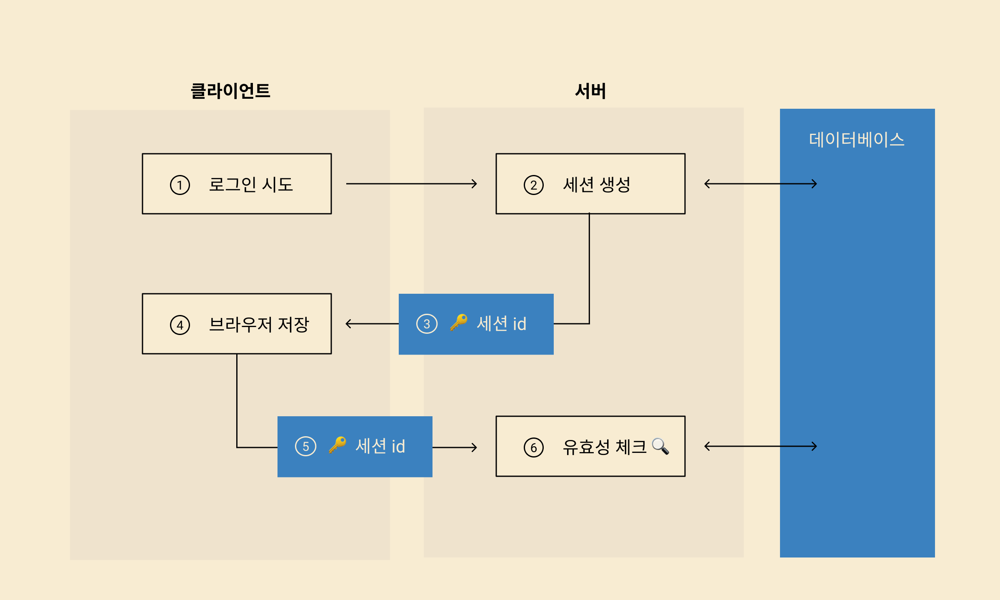
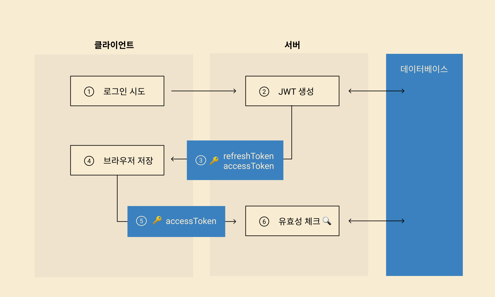
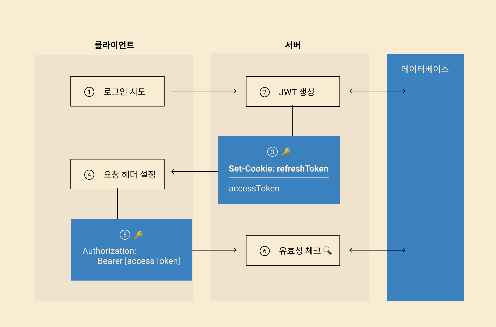

### 로그인 과정

1. 세션id 로그인 방식

   1. 유저 로그인 시도
   2. 서버는 세션 생성
   3. 생성한 세션의 id를 클라이언트에 전송
   4. 클라이언트는 id를 클라이언트에 저장
   5. 인증이 필요한 데이터를 가져올 때 서버에 id값을 보내면 서버는 그 id값을 통해 세션을 불러와 유효한지 확인하는 방식

    

2. JWT 이용하는 방식

   1. 유저가 로그인 시도
   2. 서버가 JWT 안에 인증정보 담아 보내줌 (암호화, 시그니처 추가 가능)

   - 실질적인 인증정보는 `accessToken`이다. 이것은 일정 시간이 지나면 만료하는 구조를 가진다.
   - refreshToken을 이용해 로그인을 지속적으로 유지할 수 있다.

   3. 담기는 정보 중 accessToken과 refreshToken이 이후 유저 인증에 사용된다.
   4. 이 정보를 클라이언트에 저장한다.
   5. accessToken으로 인증이 필요한 정보에 접근할 때 서버에 전달한다.
   6. 서버는 그 토큰이 유효한지 확인하는 방식으로 인증한다.

    

### 보안 뚫리는 과정

1. XSS 공격

   - 클라이언트 브라우저에 javascript를 삽입해 실행하는 공격
   - input태그에 javascipt 구문을 삽입해서 서버에 스크립트를 실행하거나 url을 통해 클라이언트에서 스크립트 실행이 가능하다면 xss공격을 할 수 있다.
   - 공격자는 javascript를 통해 특정 값을 가져오가너 API 콜을 요청할 수 있다.

2. CSRF 공격
   - 공격자가 다른 사이트에서 우리 사이트의 API 콜을 요청해 실행하는 공격.
   - 공격자가 클라이언트에 저장된 유저 인증정보를 서버에 보낼 수 있다면 제대로 로그인한 것처럼 유저 정보를 변경하거나 유저인 것처럼 행동가능하다.

### 브라우저 저장소 및 보안 이슈

- 쿠키와 로컬스토리지는 글로별 변수로 접근할 수 있다.
- 쿠키에 세션id, refreshToken, accessToken을 저장해두면 XSS로 쿠키에 담긴 값을 같이 전송하여 유저인 척 행동할 수 있다.

### 방어 방법

- 쿠키에는 refreshToken만 저장하고 새로운 accessToken을 받아와 인증에 이용하는 구조에서 CSRF를 방어할 수 있다. accessToken을 스크립트에 삽입하지 못하게 하여 방어하는 방법이다.
- `secure httpOnly` 쿠키 저장방식

  - javascript내에서 접근이 불가능하다. (XSS 공격 방지)
  - secure을 적용하면 https에서만 동작한다.
  - httpOnly 쿠키도 refreshToken만 저장하고 acessToken을 받아와 인증에 사용하므로 CSRF 공격 방어 가능

- 어떤 방식을해도 XSS 취약점이 있따면 보안 이슈 발생한다. 유저 정보 저장방식만 바꾸는 것만으로 방어는 불가능하고 클라이언트와 서버에서 추가적으로 XSS 방어 처리가 필수적이다.
  - ex) input에서 입력된 값이 html/javascript로 인식되지 않도록 서버에서 escape처리 해주고 url통해 xss안되도록 라우팅 관리. React는 자동으로 escape 처리해준다.

### 요약

- 세션id를 브라우저에 저장하는 방식은 어떤 방식이던지 보안 위험요소가 있어 JWT를 이용한 인증방식ㅇ르 이용한다.
- `refreshToken`만 `secure httponly쿠키`에 저장해 CSRF를 방어하고 `accessToken`은 `JSON payload`로 전달받는다. API를 요청할 때 `Authorization` 헤더에 넣어준다.
- 서버로 전송할 때마다 refreshToken을 이용해 새로운 accessToken을 받아와 웹 앱내 지역변수에 저장하고 사용한다
- 이런 방식으로 CSRF 공격과 `다른 선택지보다는` XSS공격에서 안전할 수 있다.
- 꼭 XSS 관련 처리를 해줘야한다.

    

---

- [출처]
  - [프론트에서 안전하게 로그인처리하기](https://velog.io/@yaytomato/%ED%94%84%EB%A1%A0%ED%8A%B8%EC%97%90%EC%84%9C-%EC%95%88%EC%A0%84%ED%95%98%EA%B2%8C-%EB%A1%9C%EA%B7%B8%EC%9D%B8-%EC%B2%98%EB%A6%AC%ED%95%98%EA%B8%B0)
