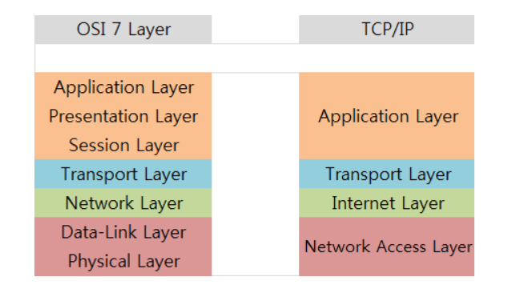

### 프로토콜

> 송신자와 수신자, 그리고 모든 중간 장치들이 효과적으로 통신하기 위해 따라야하는 규칙

### 프로토콜 계층화

> 서로 다른 계층 간에 필요한 임무를 나누는 것이다

- 장점
  - 복잡한 작업을 여러 개의 단순한 작업들로 나눌 수 있게 해준다
  - 중간에 한 계층이 고장나면 그 기계만 바꾸면 된다.
  - 서비스 구현으로부터 사용자를 독립시킨다
  - 각 계층의 기능만 구현한다면 어떤 회사의 제품을 써도 상관없을 것이다

### OSI 7 계층

> 네트워크 통신을 체계적으로 다루는 ISO표준 개방시스템상호연결(OSI) 모델

- 개방시스템: 기반 구조와 관계없이 시스템간 통신을 제공하는 프로토콜 집합
- 공통: 계층 구조 가진다 (트러블 슈팅 용이, 다른 벤더사와 호환성 해결 문제)

### TCP/IP

> 현재 인터넷에서 사용하는 인터넷 프로토콜 그룹

- 원래는 하드웨어 위의 4개의 소프트웨어 층이였으나 현재는 5계층(물리계층포함) 모델로 간주된다
- 하드웨어, 운영체제, 접속매체에 관계없이 동작하는 개방성을 가진다

### 차이점

- TCP/IP 가 OSI보다 먼저 개발되었다. 세션과 표현 계층은 TCP/IP 그룹에 없다
- 둘 다 계층형이라는 공통점이 있지만 TCP/IP는 인터넷 개발 이후 계속 표준화되어 신뢰성이 우수하나 OSI 7계층은 실제로 구현되는 예가 없어 신뢰성이 저하되었다
- OSI 모델은 장비 개발과 통신 자체를 어떻게 표준으로 잡을지에 대한 지표로 사용되며 실질적인 통신은 TCP/IP 모델을 따른다

### OSI 7계층 각 계층

1. 물리 계층
   > 데이터를 물리 매체 상으로 전송하는 역할. 링크의 설정, 유지, 해제 담당

- 전송 단위: 비트 (0,1). 광신호나 전기적 신호로 보낸다
- 사용자와 네트워크 장비 종단 사이의 물리적, 전기적인 규정
- 데이터의 전달 역할
- 케이블, 리피터, 허브

2. 데이터링크 계층

- 전송 단위: 프레임, 주소는 MAC
- 물리 계층의 전송 설비를 링크로 변환. 네트워크 계층에게 오류없는 물리계층으로 보여줌
- 네트워크계층에서 정보 받아 주소와 제어정보를 헤더와 테일에 추가한다
- 브릿지, 스위치
  - 이더넷
  - CSMA/CD 약속. 이더넷에 접속된 장치들은 언제라도 데이터 전송이 가능
  - 회선이 비면 데이터 전송하고 다른 장치 데이터와 충돌하면 충돌한 것은 버려지고 전송한 장치들에게 재전송 요구한다
  - 한 회선을 여러 장치가 쓰기 위한 것

3. 네트워크 계층

- 전송 단위: 패킷, 주소는 IP
- 논리적 링크(네트워크)를 설정하고 상위 계층의 데이터를 작은 크기의 패킷으로 분할해 전송하는 역할을 수행한다
- 라우터, 스위치
- IP, ICMP, IGMP, ARP(IP주소 -> MAC주소), RARP

4. 전송 계층

- 전송 단위: 세그먼트, 주소: Port
- osi 모델은 전송계층을 중심으로 하위 네트워크 서비스와 상위 계층 사용자 서비스로 구별한다
- end to end 전송 : 송신 컴퓨터 프로세스에서 수신 컴퓨터 프로세스로의 전달
- L4스위치
- UDP, TCP, SCTP

5. 세션 계층

- 전송 단위: 메세지`
- 네트워크 대화 제어기로 `통신 시스템간 상호대화 설정, 유지, 동기화`
- 실제 이용자 응용 프로그램 사이 세션이라 불리는 연결 확립, 유지하며 동기화하는 기능
- 표현 계층으로 부터 받은 데이터를 짧은 데이터 단위로 나눈 후 전송계층으로 보낸다

6. 표현 계층

- 전송 단위: 메세지
- 송수신자가 공통으로 이해할 수 있도록 정보의 데이터 표현 방식을 바꾸는 기능
- 송신 측의 표현 계층은 응용 계층에게 받은 데이터의 보안과 효율적인 전송을 위해 암호화와 압축으 수행해 세션 계층으로 보낸다

7. 응용 계층

- 전송단위: 메세지
- 최상위 계층으로 사용자가 네트워크에 접속하는 것을 가능하게 한다.
- 전자 우편, 원격 파일 전송 등 사용자 인터페이스 제공
- FTP, VSFTP, SNMP, SMTP, HTTP, HTTPS,DNS

### TCP/IP 각 계층

1. 네트워크 엑세스 계층

- OSI 모델의 물리 계층 + 데이터링크 계층
- 디바이스 드라이버, 네트워크 카드 등 하드웨어적인 요소와 관련된 모든 것을 지원하는 계층
- 송신측은 상위 계층으로부터 받은 패킷에 MAC 주소 정보를 가진 헤더를 추가해 프레임을 만들고 하위계층인 물리계층으로 전달한다
- 수신측은 데이터링크 계층에서 추가된 헤더를 제거하여 상위 계층인 네트워크 계층으로 전달한다

2. 인터넷 계층

- OSI 모델의 네트워크 계층에 해당
- 상위 전송 계층으로 부터 받은 데이터에 IP패킷 헤더를 붙여 전송한다

3. 전송 계층

- 네트워크 양단 호스트 사이 신뢰성있는 전송기능 제공
- 논리주소와 포트 가지고 있어서 각 상위 계층의 프로세스 연결해서 통신한다
- TCP와 UDP 프로토콜 이용
- TCP,UDP, SCTP

4. 응용 계층

- OSI 모델의 세션, 표현, 응용 계층에 해당
- 네트워크, 웹, 메일 서비스 등 인터페이스 제공

---

- 출처
  - [https://goitgo.tistory.com/25](https://goitgo.tistory.com/25)
