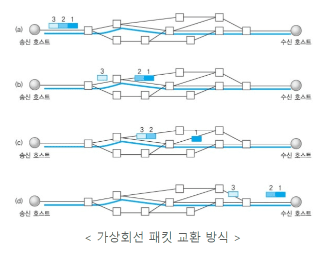
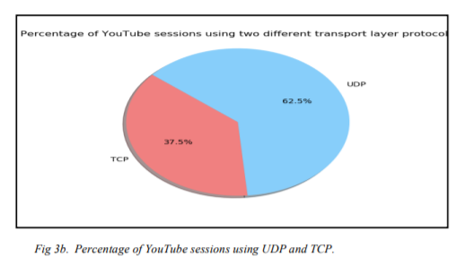

### IP (Internet Protocol)

- internet protocol
- 네트워크를 연동하는 프로토콜이다
- 연결을 보장하기 위한 노력은 하지만 100%보장은 아니다 (Best-effort)
- 그 이유는 서로 다른 특성의 여러 네트워크를 연동해야되기 때문이다

### UDP (User Datagram Protocol)

> (DNS, 실시간 스트리밍 서비스, Multicast, VoIP, RTP(Real time protocol))

- 다른 컴퓨터와 데이터 통신을 하기 위한 프로토콜의 일정
- OSI 4계층 전송 계층 프로토콜
- TCP는 데이터 신뢰성을 보장하기 위해서 이메일이나 파일 전송같이 100% 데이터 보장이 필요한 경우에는 필수요소이다. 하지만 실시간 스트리밍 서비스에서는 문제가 된다. 하나를 다시 받기 위해 버퍼링으로 재생이 중지되며 혼잡 제어를 하면서 영상 데이터 퀄리티에 문제가 생겨서는 안된다. 이에는 UDP를 사용한다.

- UDP는 데이터 신뢰성을 보장하지 않고 일단 보낸다. 받는 쪽에서 제대로 받고 있는 지 신경쓰지 않는다. UDP로 데이터를 보낼 경우 32Kbps 등 속도 옵션만 제공한다.

- 실시간 영상 스트리밍 등에서 점 몇개를 안나온다고 전체 영상에 크게 문제가 생기지 않는다. 전송 속도가 더 중요하다. 따라서 실시간 스트리밍 등에서는 UDP가 더 잘 쓰인다.

- TCP보다 용량이 가볍고 송신 속도가 빠르다. 신뢰도는 TCP보다 떨어진다.
- UDP는 비연결형, TCP는 연결형이라 구분한다
- 비연결형이란 것은 데이터를 보낸다는 것을 상대방에게 알리지 않고 보내버리는 것이다.

### TCP

> (GMAIL, 웹 HTTP통신, 이메일, 파일전송)

- OSI 4계층 전송계층 프로토콜, 하위 네트워크 계층 IP와 엮어서 TCP/IP로 표현한다.

- 개발된 배경은 군사적인 목적으로 어느 환경에서도 정상적으로 동작하는 네트워크 개발에 있었다. 패킷 교환 방식으로 목적지가 정해져있지만 목적지까지의 경로는 정해져있지 않았다. 따라서 서로 연결이 가능한 회선 하나만 있어도 통신이 되는 환경을 구축하였다.
- 위의 방식은 네트워크 안정성은 떨어져 중간에 데이터가 유실되거나 너무 늦게 전달되는 신뢰성의 문제가 있었고 이를 해결하기 위해 신뢰성을 보장하는 통신 프로토콜인 TCP가 등장하였다.

- UDP와 다르게 TCP Header에는 확인 응답 (acknowledge)가 있어 ACK를 기반으로 재전송과 타임아웃 방법을 이용하여 신뢰성을 보장하고 흐름을 제어한다.

### ACK 방법 2가지 Selective ACK, cumulative ACK

- Selective ACK: 여러 개 패킷에 대해 어떤 ACK응답 받았는지 모두 기억.
- Cumulative ACK: 한 번에 여러 패킷을 전송해도 문제가 되는 ACK하나만 기억.
- 초기 TCP는 cumulative ACK기반이었으나 응답받지 못한 것 기준으로 그 뒤의 것을 모두 버리는 것이 비효율적이었다. 따라서 Selective ACK가 후에 TCP 옵션으로 채택되었다.

### 혼잡 제어 (Congestion Control)

- 초기 TCP에는 혼잡 제어가 없었으나 사용자가 늘면서 네트워크 회선이 부하를 감당하지 못하였다.
- 이를 해결하기 위해 혼잡 제어가 등장했다.
- 데이터를 전송한 후 상대가 잘 받으면 조금씩 양을 늘린다. 만약 상대가 잘 못받으면 그 양을 확 줄인다. (AIMD, Addictive increase/multicative decrease)

### 연결형, 가상 회선 패킷 교환 방식

- 발신지와 수신지를 연결해 패킷을 전송하기 위한 논리적인 경로를 배정한다

- 각 패킷이 동일한 수신지 주소(IP 주소)를 가지고 있더라도 패킷들은 네트워크의 서로 다른 경로를 통해 전송될 수 있다.
- 수신지 TCP는 패킷을 재조립하여 누락된 패킷이 있는지 확인한다.

### 비연결형, 데이터그램 패킷 교환 방식

- 데이터그램은 독립적인 관계를 지니는 패킷이다.
- 연결을 위해 할당되는 논리적인 경로가 없다.
- 각각의 패킷은 다른 경로로 전송되고 서로 독립적인 관계를 가진다.
- TCP처럼 메세지를 패킷(데이터그램)으로 나누고 재조립하는 기능음 없다.

---

- 참고한 글 중에 유튜브는 UDP인가 TCP인가? 라는 체크사항이 있어서 궁금해서
  찾아보았다

- Netflix와 Amazon Prime은 TCP를 쓰는 것에 반해 Youtube는 UDP와 TCP를 모두 쓰는데 UDP의 비중이 좀 더 높다. 실시간 스트리밍 서비스 때문이 아닐까 했는데 http 버전에 이유가 있는 것 같다.

- 이미지 출처: [https://www3.cs.stonybrook.edu/~arunab/course/2019-3.pdf](https://www3.cs.stonybrook.edu/~arunab/course/2019-3.pdf)

---

- 출처
  - [https://www3.cs.stonybrook.edu/~arunab/course/2019-3.pdf](https://www3.cs.stonybrook.edu/~arunab/course/2019-3.pdf)
  - [https://goodgid.github.io/TCP-UDP/](https://goodgid.github.io/TCP-UDP/)
