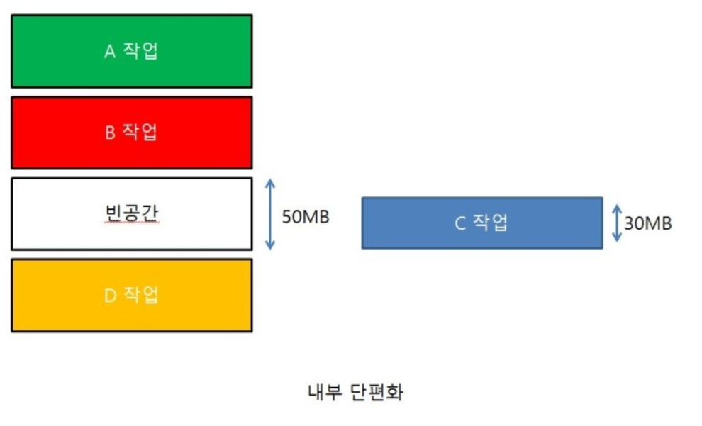
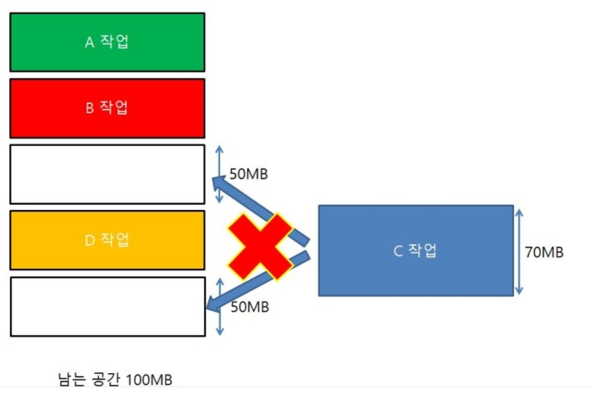

### 단편화 (Fragment)

- 메모리 공간의 부분 부분이 비어 `사용가능한 메모리가 존재하지만 프로세스 할당이 불가능한 상태`

### 내부 단편화

> 프로세스가 필요한 크기보다 `더 큰 메모리가 할당되었을 때 남는 메모리 공간이 낭비되는 상태`

### 외부 단편화

> `총 메모리 공간은 충분`하지만 실제로 `프로세스를 할당할 수 없는 상태`

### 단편화 해결 방법

1. 페이징 기법 - 가상 메모리 사용, 외부 단편화 해결, 내부 단편화 존재

- 보조기억장치 블록: `페이지`
- RAM 블록: `프레임`
- 사용하지 않는 프레임을 페이지로 옮기고 필요한 메모리를 페이지 단위로 프레임에 옮긴다
- 매핑을 위해서 PAGEING TABLE 생성
- 연속적이지 않은 공간도 활용가능하므로 필요한 부분만큼 잘라서 가져오기 때문에 외부 단편화는 해결하지만 페이지는 고정된 크기이기 때문에 내부 단편화는 그대로 존재한다

2. 세그멘테이션 - 가상 메모리 사용, 내부 단편화 해결, 외부 단편화 존재

- 서로 크기가 다른 논리적 단위인 세그먼트로 분할해서 메모리를 할당한다
- 각 세그먼트는 연속된 공간에 저장되어 있다
- 크기가 달라 미리 분할할 수 없고 메모리에 적재될 때 빈 공간을 찾아 할당한다
- 세그멘테이션 테이블 필요
- 필요한 크기만큼 사용하여 내부 단편화해결
- 중간에 프로세스가 메모리를 해제하면 구멍이 생기는데 외부 단편화 문제 생긴다

3.  메모리 풀(Memory Pool)

- 필요한 메모리 공간을 `사용자가 직접 지정`해 `미리 할당받아놓고 필요할 때마다 사용하고 반납`하는 기법

- 미리 공간을 할당해놓는다 => 외부 단편화 해결
- 필요한 크기만큼 할당 => 내부 단편화 해결
- 메모리를 할당해놓고 사용하지 않으면 메모리 낭비가 일어난다
- 미리 할당해놓고 사용하지 않는 순간에도 할당되어 있어`메모리 누수` 발생
- 메모리 할당과 해제가 잦을 때 사용하면 좋은 방식이다

---

- [https://knoc-story.tistory.com/8](https://knoc-story.tistory.com/8)
- [https://m.blog.naver.com/rbdi3222/220623825770](https://m.blog.naver.com/rbdi3222/220623825770)
- [https://junghyun100.github.io/%EB%A9%94%EB%AA%A8%EB%A6%AC%EB%8B%A8%ED%8E%B8%ED%99%94/](https://junghyun100.github.io/%EB%A9%94%EB%AA%A8%EB%A6%AC%EB%8B%A8%ED%8E%B8%ED%99%94/)
