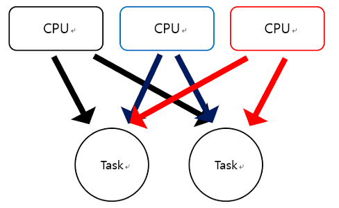

## 멀티 프로세싱 (multi-processing)

- `두 개 이상의 프로세서(cpu)`가 협력적으로 작업을 동시에 처리하는 것

  

* 각 프로세서가 하나의 작업만이 아니라 다수의 작업을 처리한다
* `하나의 작업은 다수의 프로세서에 의해서 처리`된다

- 장점
  - 여러 프로세스가 동일한 데이터를 사용한다면 이런 데이터를 하나의 디스크에 두고 모든 프로세서가 공유하도록 하면 비용적으로 저렴해진다
  - `하나의 작업을 한 프로세서만 처리한다면 해당 프로세서가 고장났을 때 작업은 정지`된다
  - 멀티프로세서는 하나의 프로세서가 고장나도 느려질 뿐 작업이 멈추지 않는다

## 멀티 프로그래밍 (multi-programming) -자원의 낭비 최소화

- 특정 프로세스 a에 대해 프로세서가 작업 처리시 `낭비되는 시간동안 다른 프로세스를 처리하는 것`이다 (ex. SMT)

## 멀티 태스킹 (multi-tasking) - 정해진 시간동안 번갈아 가며 여러 작업 처리

- 다수의 task(작업)을 운영체제 스케줄링에 의해 번갈아가며 수행하는 것이다
- `시분할 시스템이` 있다
- 프로세서가 각각의 `task를 조금씩 자주 번갈아가며 처리`하기 때문에 사용자는 마치 `동시에 여러 task가 수행되는 것처럼 보게 된다`

## 멀티 쓰레딩 (multi-threading) - 하나의 프로그램에서 병렬 처리

- 하나의 프로세스 내 여러 스레드가 존재한다
- 다수의 쓰레드는 `하나의 데이터 자원`을 공유한다
- `메모리 효율성`을 높일 수 있다
- 운영체제가 `소프트웨어적으로 운영`하는 기법

## CPU 멀티 쓰레딩

- `하드웨어적`인 방법으로 하나의 CPU에서 여러 쓰레드를 동시에 처리하는 병렬처리기법
- 한 번에 하나씩 처리해야하는 쓰레드를 파이프라인 기법으로 동시에 여러 스레드를 처리하도록 한 기법이다.

### 멀티 프로세스 vs 멀티 쓰레드

1. 자원의 효율성 증대

   - 멀티 스레드로 실행하면 프로세스를 생성해 `자원을 할당하는 시스템 콜이 줄어 자원을 효율적으로 관리`할 수 있다
   - 프로세스 간 문맥교환시 cpu 레지스터 교체 뿐만 아니라 ram과 cpu사이 캐시 메모리에 대한 데이터도 초기화되며 오버헤드가 발생한다.
   - 쓰레드는 프로세스 내 메모리를 공유하기 때문에 독립적인 프로세스와 달리 스레드 간 데이터를 주고 받는 것이 간단하고 시스템 자원 소모가 줄어든다

2. 처리 비용 감소 및 응답 시간 단축

   - 통신비용 절감:프로세스 간 통신보다 스레드간 통신 비용이 적다
   - context switching시 쓰레드는 stack 영역만 처리하기 때문에 프로세스 간 전환 속도보다 쓰레드 간 전환속도가 빠르다.

3. 단점: `동기화 문제`
   - 쓰레드 간 자원 공유는 `전역 변수를 사용하므로 충돌이 발생할 수 있다`
   - 한 쓰레드의 문제가 생기면 전체 프로세스에 영향을 끼치지만 프로세스는 독립적이기 때문에 한 프로세스의 문제가 다른 프로세스에 영향을 끼치지 않는다.
   - 동기화를 통해 스레드 작업 처리 순서와 공유자원에 대한 접근 컨트롤 할 수 있다
   - 싱글코어 멀티스레딩은 context switching이나 동기화 등의 이유로 인하여 스레드 생성시간이 오히려 오버헤드로 작동할 수 있다

### 동시 멀티 쓰레딩 (SMT - Simultaneous multi threading)

#### `멀티 프로그래밍`의 일종이다

- 인텔에서 부르는 `하이퍼 쓰레딩`으로 유명
- AMD에서 기존의 불도저에 적용한 CMT 구조 버리고 RYZEN에 적용하면서 거의 모든 데스크탑 CPU에 적용되는 기술
- 단일 코어에서 명령어 종속성(처리 순서 등)을 줄이고 병렬처리 능력을 증가시키는 개념의 기술
- A -> B-> C 순으로 처리할 때 A가 오래 걸리는 작업이라면? 기다리는 것이 비효율적
- 하이퍼스레딩은 놀고 있는 부분에 명령어 종속성이 없는 다른 스레드의 명령어를 투입해 CPU 효율을 높이는 우회책
- ***

- 출처
  - [굳긷 블로그 -멀티로 시작하는 OS 단어 정리](https://goodgid.github.io/OS-Start-From-Multi/)
  - [멀티 프로세스 대신 멀티 스레드 사용하는 이유?](https://gmlwjd9405.github.io/2017/10/01/basic-concepts-of-development-os.html)
  - [SMT- 나무위키](https://namu.wiki/w/SMT)
- [멀티 쓰레드 장단점](https://eun-jeong.tistory.com/20)
