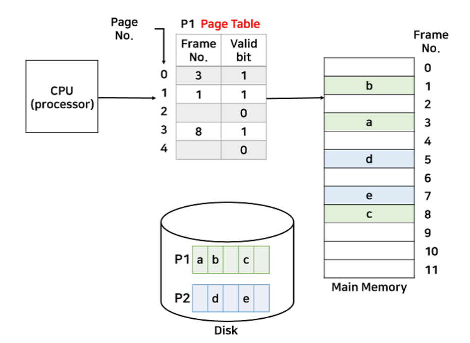
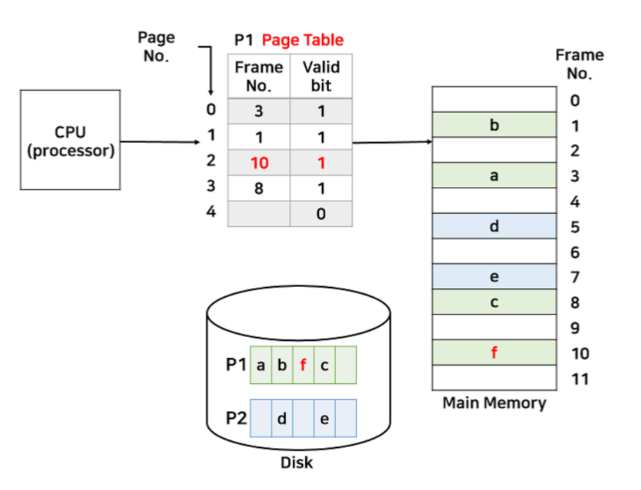

### 가상 메모리

> 물리 메모리 크기 한계 극복하기 위해 나온 기술

- 필요한 부분만 메모리에 적재해서 사용한다.
- 프로세스 일부분은 페이지 단위일수도 세그먼트 단위일 수도 있다.
- 현재 대부분은 페이지 단위
- 이처럼 현재 필요한 페이지만 메모리에 올리는 것을 `요구 페이징`이라고 한다

### 요구 페이징 (Demanding paging)

- 기존 페이지 테이블과 다른점은 valid bit가 추가되었다.
- valid bit가 1이면 현재 페이지가 메모리에 있다는 뜻

- 위는 p1의 3번째 페이지를 메모리에 올린 모습니다.

### 페이지 폴트 Page Fault

- cpu가 접근하려는 페이지가 메모리에 없을 때
- 페이지 테이블 valid bit가 0인 경우
- cpu에 인터럽트 신호를 보내 운영체제 내부해당 ISR로 점프한다
- 해당 페이지를 비어있는 프레임에 할당한다
- 페이지 테이블을 갱신한다 (프레임 번호 설정, valid bit 1로 변경)
- 다시 명령어로 돌아가서 실행

### Pure Demanding Page

> 프로세스가 최초로 실행될 때 어떤 페이지가 필요한 지 알 수 없어서 아무 페이지도 올리지 않는다

- 프로그램 실행하자마자 page fault 발생
- 순수하게 필요한 페이지만 올리는 것
- 메모리 효율적으로 사용하나 시작부터 페이지 폴트가 발생해 느리다

### Prepaging

> Pure paging과 반대되는 개념

- 필요하다고 판단되는 페이지를 미리 올린다
- 페이지 폴트가 발생할 확률이 적어 속도면에서 빠르다
- 미리 올라간 페이지를 사용하지 않으면 메모리 낭비이다

### Swapping vs Demanding paging

- 둘 다 메모리와 backing store 오간다
- 스와핑은 `프로세스 단위`
- 요구 페이징은 `페이지 단위`

### 유효 접근 시간 Effective access time

- 페이지 테이블에 해당 페이지가 없어서 페이지 폴트 발생시 시간 차이가 발생한다
- 평균적으로 어느 정도 소요되는지 계산
- 지역성의 원리로 페이지 부재 확률은 낮다
- 메모리 접근은 시간적 공간적 지역성을 가진다
- 시간적 지역성
  - 같은 메모리 공간을 특정 시간내 다시 읽을 확률이 높다 (반복문)
- 공간적 지역성
  - cpu가 메모리 공간을 읽을 때 인접한 범위에서 읽는다 (배열)

### 페이지 교체

> 메모리가 모두 찼담녀 페이지 폴트시 이미 메모리에 있는 페이지 중 하나를 backing store로 보내고 새로운 페이지를 메모리에 올려야 한다

- page-out 된 페이지를 victim page라 한다

### victim page

- 어떤 페이지를 page-out할까를 정할 때 해당 페이지가 수정되지 않는 페이지를 고르는 것이 좋다
- modified bit(=dirty bit)을 추가해 이를 검사한다
- 해당 페이지가 수정되었다면 1으로 둔다

---

- 출처
  - [https://velog.io/@codemcd/%EC%9A%B4%EC%98%81%EC%B2%B4%EC%A0%9COS-15.-%EA%B0%80%EC%83%81%EB%A9%94%EB%AA%A8%EB%A6%AC](https://velog.io/@codemcd/%EC%9A%B4%EC%98%81%EC%B2%B4%EC%A0%9COS-15.-%EA%B0%80%EC%83%81%EB%A9%94%EB%AA%A8%EB%A6%AC)
